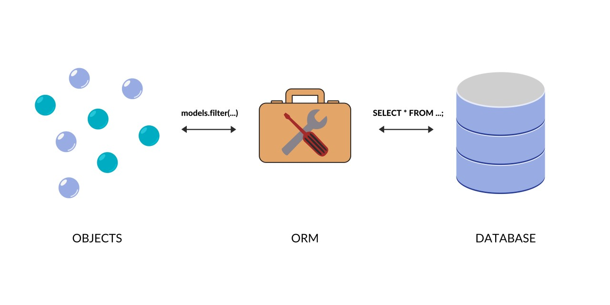
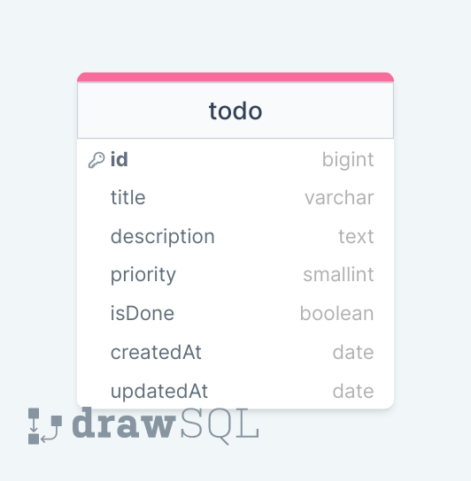

# TODO Project with Sequelize

## What? Why?

### Model Logic in MVC:

### ORM:

### SEQUELIZE:

https://sequelize.org/

## TODO API

### ERD:

### server'i kurup terminalde asagidaki kodu yazarakda serveri calistirabiliriz ama anlik degisiklikleri yakalayamiyor nodemon gibi

## $ node server.js --watch

##package.json icindeki script kisminda yazilmis olan key value ciftleri ne anlama gelmekte

ben
terminalde
$npm test
$npm start
yazdigimda terminalde karsilarina ne yazdiysam onlar benim karsima cikar
ama ben bu ikisi disinda npm tarafindan taninmayan yeni bir key yazarsam bunu calistirmak icin
$npm run devStart
yazmam gerekir

postgres pass:kp12345
